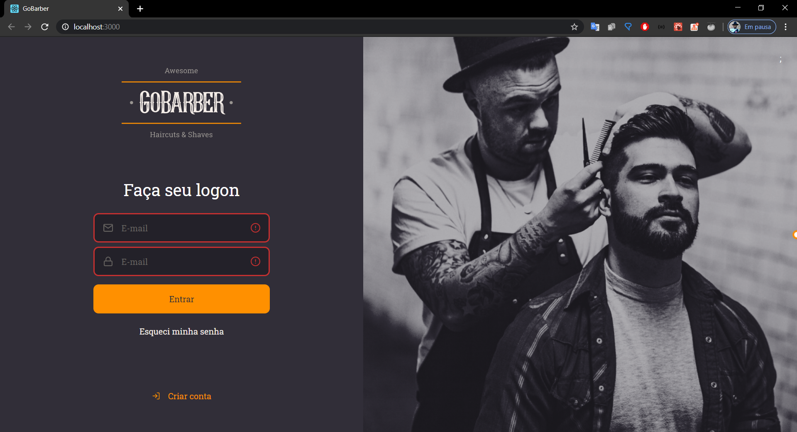
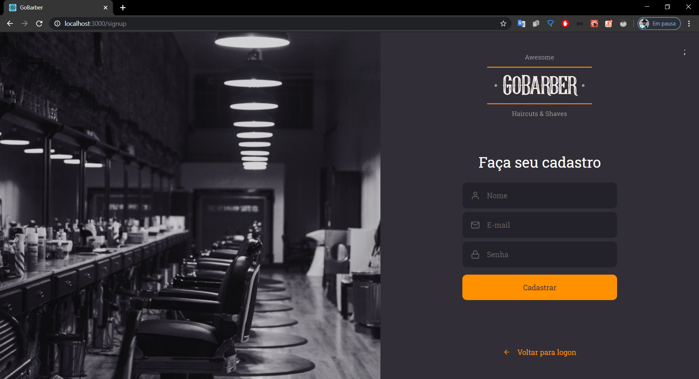

<h1 align="center">
    
</h1>

<h3 align="center">
  GoBarber 🧔
</h3>

  <a href="#rocket-sobre-o-desafio">Sobre</a>&nbsp;&nbsp;&nbsp;|&nbsp;&nbsp;&nbsp;
  <a href='#gear-oque-foi-utilizado'>O que foi utilizado</a>&nbsp;&nbsp;&nbsp;|&nbsp;&nbsp;&nbsp;
  <a href="#camera-imagens">Imagens</a>&nbsp;&nbsp;&nbsp;|&nbsp;&nbsp;&nbsp;
  <a href="#Instalar e usar">Instalar e usar</a>

## 💈 Sobre

 O GoBarber é um sistema para agendamentos de cortes de cabelo, e o web site é para os provedores de serviço.

## ⚙️ O que foi utilizado
<ul>
  <li>ReactJS</li>
  <li>Typescript</li>
  <li>Styled-components</li>
  <li>UnForm</li>
  <li>Context API</li>
  <li>Axios</li>
  <li>polished</li>
  <li>yup</li>
  <li>Hooks</li>
  <li>JWT</li>
</ul>

## 🛠 Funcionalides

<ul>
  <li>Criar conta</li>
  <li>Logar no sistema</li>
</ul>

## 📷 Imagens

<strong>Login</strong>
 

  
<strong>Cadastro</strong>
  

 

## 🚀 Instalar e usar

###### Clone o respositório.
``git clone git@github.com:lucas000/GoBarber11/tree/master/gobarber-web``

###### Instalando as dependências.
``cd gobarber-web ``
`` yarn ou npm install``

###### Executar o sistema.
``yarn start ou npm run start ``

## 🤝 Para contribuir

Você pode enviar quantos PR's deseja, ficarei feliz em analisá-los e aceitá-los! E se você tiver alguma dúvida sobre o projeto...

 
E-mail: lucasdejesus000@gmail.com

LinkedIn: <a href="https://www.linkedin.com/in/lucaslourencodejesus/">https://www.linkedin.com/in/lucaslourencodejesus/</a>

Obrigado! Te vejo em breve :)
